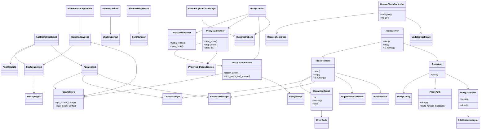

# 架构与依赖约束

## 分层

- UI -> actions -> services -> 领域模块（cert/hosts/network/proxy/update）-> runtime/platform
- `modules/` 根目录只保留薄 shim 或必须的 `__init__.py`。

## 依赖约束

- UI 不得直接 import 领域模块。
- actions 负责编排 services；services 定义副作用边界。
- 平台相关逻辑放在 `modules/platform`（或显式的平台子模块）。

## 重构前后对比


## 类图



## 错误处理

- 在 service/action 边界使用 `OperationResult`。
- 字段：
  - `ok`：成功标记
  - `message`：人类可读摘要
  - `code`：`ErrorCode` 枚举值（可选）
  - `details`：结构化上下文载荷

### 错误码（核心）

- `NETWORK_ERROR`
- `REMOTE_ERROR`
- `NO_VERSION`
- `BACKUP_DIR_MISSING`
- `NO_BACKUPS`
- `CONFIG_INVALID`
- `FILE_NOT_FOUND`
- `PERMISSION_DENIED`
- `PORT_IN_USE`
- `UNKNOWN`

### 示例

```python
from modules.runtime.error_codes import ErrorCode
from modules.runtime.operation_result import OperationResult

def example_call() -> OperationResult:
    return OperationResult.failure(
        "Request failed",
        code=ErrorCode.NETWORK_ERROR,
        retry_after=30,
    )
```

## 自检清单

- UI 仅通过 actions/services 访问业务能力，不直接 import 领域模块。
- 领域模块不直接操作 UI；副作用通过 services 管理。
- 平台相关实现只出现在 `modules/platform` 或显式平台子模块。
- `OperationResult` 失败时尽量填写 `ErrorCode`，避免语义漂移。
- `modules/` 根目录仅保留必要脚本与 `__init__.py`。

## 入口与依赖说明

- GUI 启动入口：`mtga_gui.py` 负责 UI 装配与流程编排。
- 配置与证书等系统资源读写通过 `services` 层触达，避免跨层访问。
